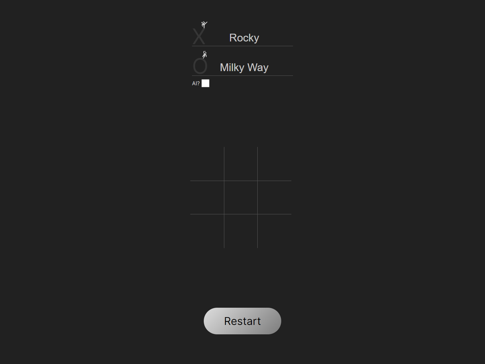

# Odin-Tic-Tac-Toe

[Live link is here.](https://x6nenko.github.io/Odin-Tic-Tac-Toe/)

## Project tasks.
- [x] Add gameBoard and displayController modules. Add player factory.
    - [x] Store gameboard as an array inside of a Gameboard object.
    - [x] Control the flow of the game inside the displayController.
    - [x] Store players inside the factory.
- [x] Render the contents of the gameboard array to the webpage.
- [x] Build the functions that allow players to add marks to a specific spot on the board, and then tie it to the DOM, letting players click on the gameboard to place their marker. Don’t forget the logic that keeps players from playing in spots that are already taken.
- [x] Build the logic that checks for when the game is over! Should check for 3-in-a-row and a tie.
- [x] Clean up the interface to allow players to put in their names, include a button to start/restart the game and add a display element that congratulates the winning player.

### Optional project tasks:
- [x] Create AI.
    - [x] Start by just getting the computer to make a random legal move.
    - [ ] Create an unbeatable AI using the minimax algorithm.